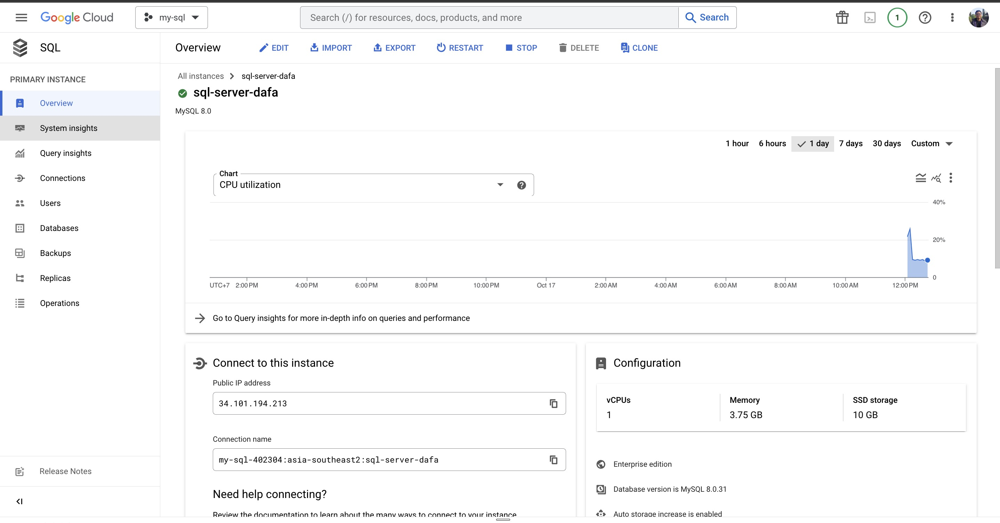
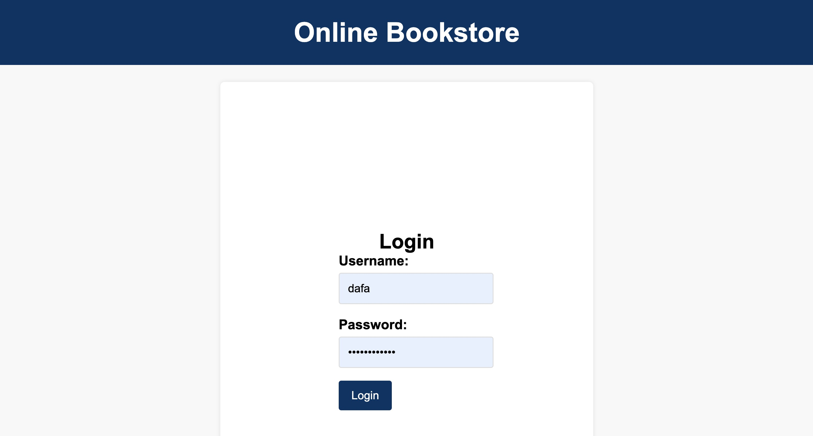
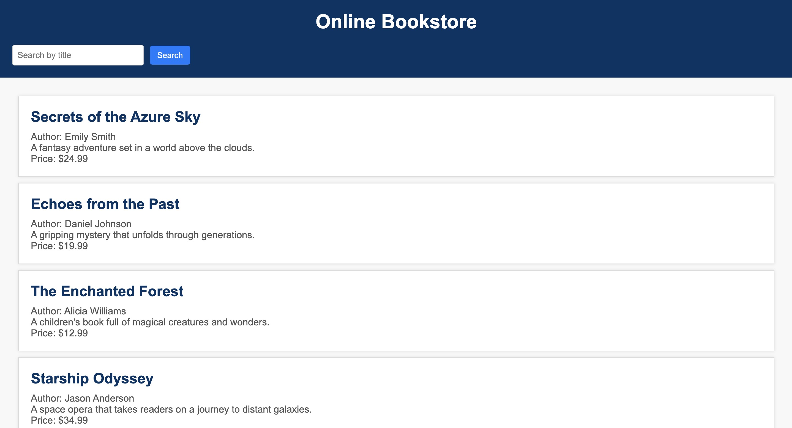

# OnlineBookStore and Google Cloud DB Deployment with Kubectl and Minikube
Pre-requisites : 
1. Deploy Google Cloud SQL Server
2. Create database and insert data (can check sql_script.sql file)
3. Whitelist your local public ip address
4. Install docker
5. Install kubectl
6. Install minikube

## Starting Minikube and see running nodes
> minikube start  
> minikube status  
> minikube service list  
> kubectl get nodes  
> minikube addons enable heapster; minikube addons enable ingress  

## Building docker image
> docker build -t online-book-store .  

## Applying
> kubectl apply -f app-deployment.yaml  
> kubectl apply -f app-service.yaml  
> kubectl apply -f app-ingress.yaml  

## Troubleshooting if you got some errors
> kubectl get pods  
> kubectl logs online-book-store-2-768cf6f99f-d4kgl  
> kubectl exec -it online-book-store-2-cb944c756-66zgp -- /bin/sh  
> kubectl get pods online-book-store-2-cb944c756-66zgp -o jsonpath='{.spec.containers[*].name}'  
> kubectl delete pods --all -n default  
> kubectl delete pods -l app=online-book-store  
> docker run -it --rm online-book-store /bin/sh   
Setting Up Google Cloud SQL 
 
   Login Page 
 
   Main Page

   Main Page for Search Button 
 
